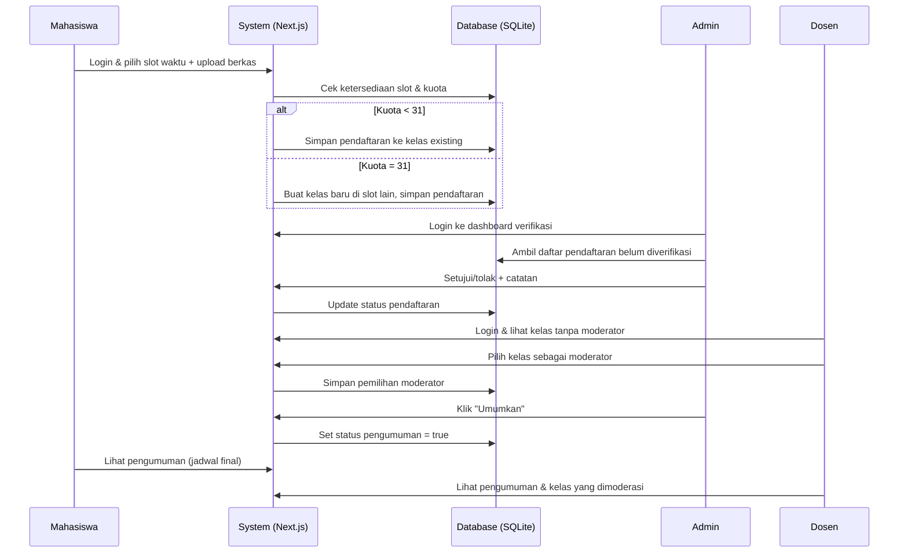
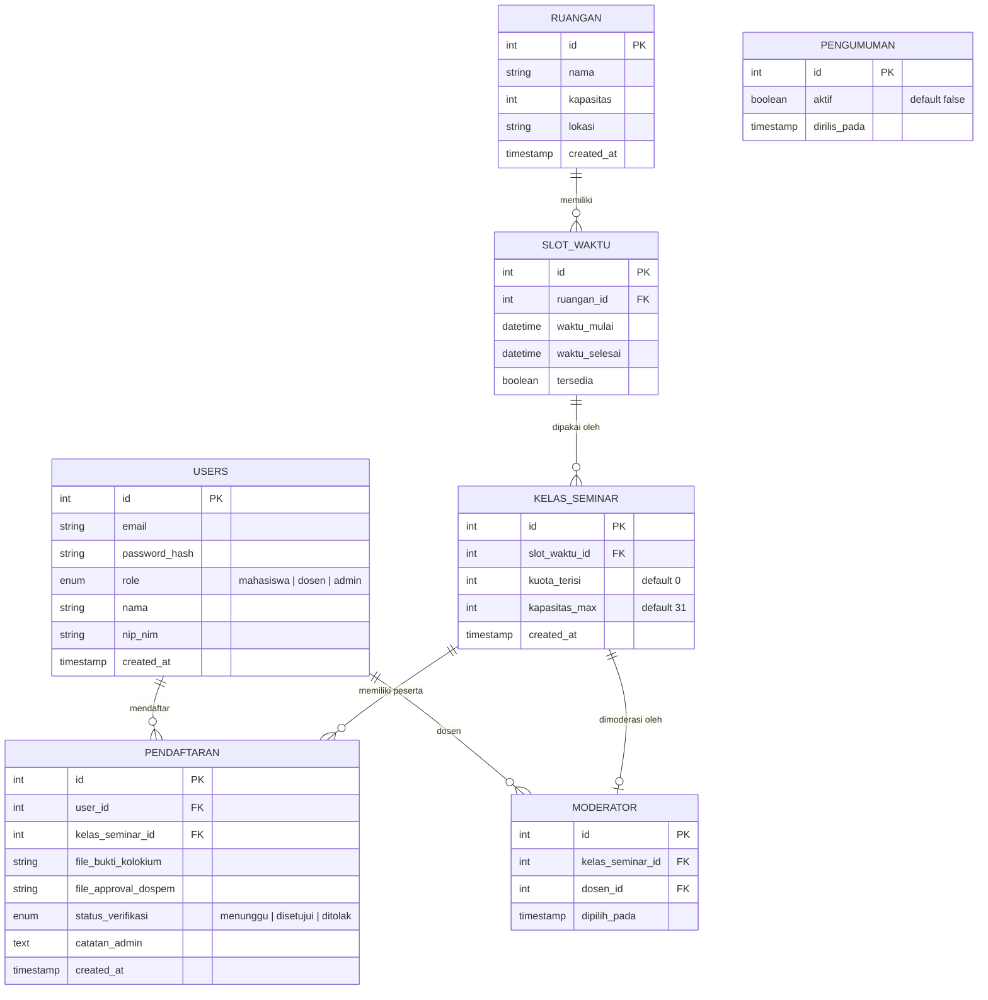

# PRD — Project Requirements Document

## 1. Overview
Pendaftaran seminar hasil penelitian di banyak kampus masih bergantung pada spreadsheet yang diisi manual oleh admin. Cara ini rawan kesalahan: jadwal bentrok, pembagian kelas tidak merata, proses verifikasi lambat, dan pemilihan moderator tidak terstruktur. Aplikasi ini hadir untuk menggantikan spreadsheet dengan sistem web terpadu yang memungkinkan mahasiswa mengajukan jadwal secara mandiri, sistem otomatis membentuk kelas berkapasitas 31 mahasiswa tanpa bentrok waktu/ruangan, admin memverifikasi berkas (bukti forum kolokium & persetujuan dosen pembimbing) secara manual, dosen memilih moderator sendiri, serta admin mengelola ruangan dan mengumumkan hasil akhir melalui dashboard.

## 2. Requirements
1. **Sistem otentikasi** – memisahkan peran mahasiswa, dosen, dan admin dengan hak akses berbeda.
2. **Pengajuan jadwal** – mahasiswa dapat memilih slot waktu yang tersedia (tanggal, jam, durasi).
3. **Pembentukan kelas otomatis** – setiap kelas maksimal 31 pendaftar; sistem membuat kelas baru jika kuota penuh dan memastikan tidak ada jadwal bentrok dalam satu ruangan yang sama.
4. **Upload berkas verifikasi** – mahasiswa wajib mengunggah bukti forum kolokium dan persetujuan dosen pembimbing dalam format PDF/Gambar.
5. **Verifikasi manual oleh admin** – admin memeriksa berkas dan menyetujui/menolak pendaftaran via dashboard khusus.
6. **Pemilihan moderator** – dosen dapat memilih sesi kelas tertentu untuk menjadi moderator dari dashboard dosen.
7. **Manajemen ruangan** – admin dapat menambah, mengedit, dan menghapus data ruangan yang akan digunakan untuk kelas.
8. **Dashboard & pengumuman** – admin dapat melihat statistik pendaftaran, memverifikasi masal, serta mengumumkan jadwal final yang dapat dilihat semua pengguna.

## 3. Core Features
- **Pengajuan jadwal oleh mahasiswa** – pilih slot waktu dari ruangan yang tersedia; sistem mengecek bentrok secara real-time.
- **Auto-generate kelas** – sistem mengelompokkan mahasiswa ke dalam kelas berkapasitas maksimal 31 orang; jika suatu slot sudah penuh, slot baru otomatis dibuat di waktu berbeda pada ruangan yang sama atau ruangan lain.
- **Upload & verifikasi dokumen** – mahasiswa upload bukti forum kolokium dan approval dospem; admin bisa melihat pratinjau berkas dan klik setujui/tolak disertai catatan.
- **Pemilihan moderator oleh dosen** – dosen melihat daftar kelas yang belum memiliki moderator dan memilih satu kelas untuk dimoderasi; satu kelas hanya memiliki satu moderator.
- **Manajemen ruangan** – admin mengatur nama ruangan, kapasitas, dan slot waktu yang tersedia.
- **Dashboard admin & dosen** – admin: daftar verifikasi, ringkasan pendaftaran, atur pengumuman; dosen: daftar kelas yang tersedia untuk moderasi.
- **Halaman pengumuman publik** – setelah admin merilis, semua pengguna dapat melihat daftar kelas, peserta, moderator, ruangan, dan waktu.

## 4. User Flow
1. **Admin** menyiapkan periode pendaftaran, data ruangan, dan slot waktu yang bisa dipilih.
2. **Mahasiswa login** → pilih menu "Daftar Seminar" → pilih slot waktu yang tersedia → upload bukti forum kolokium & persetujuan dospem → submit. Mahasiswa mencari ruangan dan menginputkannya ke jadwal yang telah dipilih
3. **Sistem** otomatis menambahkannya ke kelas; jika kuota 31 tercapai, buat kelas baru dengan slot berbeda.
4. **Admin** membuka dashboard verifikasi → periksa berkas satu per satu/massal → setujui atau tolak. flow ini bisa berjalan beriringan, tidak menjadi syarat flow selanjutnya. Admin tidak bisa melakukan finalisasi jadwal jika ruangan belum diinputkan oleh mahasiswa pada slot jadwal yang telah dipilih.
5. **Dosen login** → lihat daftar kelas yang belum ada moderator → pilih satu jadwal→ konfirmasi sebagai moderator. 
6. Setelah semua terverifikasi, **admin** menekan tombol "Umumkan" → semua pengguna bisa melihat jadwal final di halaman pengumuman.
7. **Mahasiswa** & **dosen** bisa melihat jadwal masing-masing (mahasiswa: kelasnya; dosen: kelas yang dimoderasi) di dashboard pribadi.

## 5. Architecture

## 6. Database Schema

**Keterangan kolom utama:**
- **USERS**: menyimpan data pengguna; role menentukan hak akses.
- **RUANGAN**: daftar ruangan beserta kapasitas fisik.
- **SLOT_WAKTU**: jendela waktu spesifik per ruangan; `tersedia` untuk menandai apakah slot masih bisa dipilih atau sudah penuh/bentrok.
- **KELAS_SEMINAR**: representasi kelas yang di-generate otomatis. Setiap kelas terkait satu slot waktu dan memiliki batas 31 mahasiswa. `kuota_terisi` bertambah setiap ada pendaftaran disetujui.
- **PENDAFTARAN**: menyimpan data pengajuan mahasiswa; `status_verifikasi` diubah oleh admin secara manual.
- **MODERATOR**: mencatat dosen yang memilih kelas tertentu. Satu kelas hanya boleh punya satu moderator (unique constraint pada `kelas_seminar_id`).
- **PENGUMUMAN**: flag tunggal yang menunjukkan apakah jadwal final sudah dirilis; hanya satu baris data.

## 7. Tech Stack
- **Framework**: Next.js (App Router) – full-stack React dengan SSR/SSG
- **Styling**: Tailwind CSS + shadcn/ui (komponen siap pakai)
- **Database ORM**: Drizzle ORM – type-safe, mendukung SQLite
- **Database**: SQLite – ringan, cocok untuk skala kampus kecil-menengah
- **Authentication**: Better Auth – library auth modern dengan dukungan multi-peran (email/password, social login opsional)
- **File Upload**: API Routes Next.js + penyimpanan lokal/cloud (Turbopack/local storage atau layanan seperti Uploadthing)
- **Deployment**: Vercel (rekomendasi) atau Node.js server

---

*Dokumen ini merupakan PRD high-level; detail teknis akan dijabarkan dalam spesifikasi teknis dan user stories.*