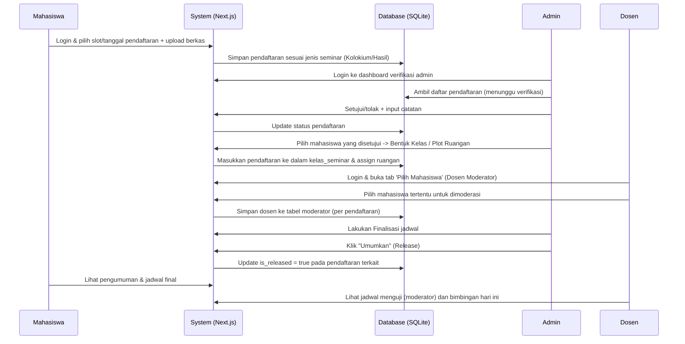
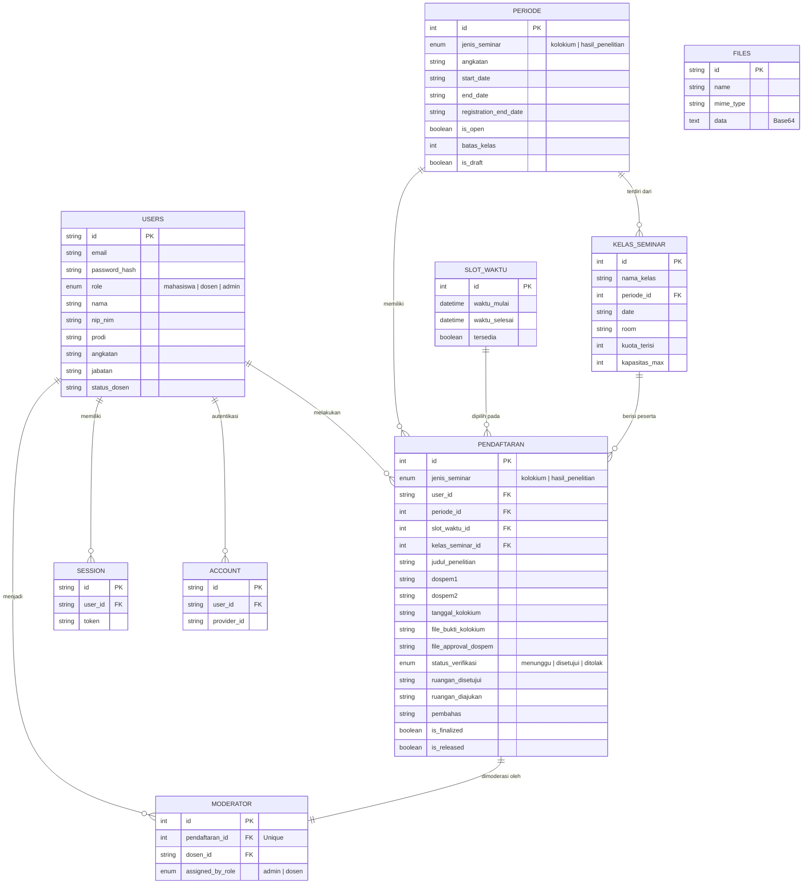

# PRD Update — Sistem Penjadwalan Seminar Kolokium dan Seminar Hasil Penelitian

## 1. Overview
Aplikasi ini hadir untuk memodernisasi dan mengotomatisasi proses pendaftaran seminar (Kolokium dan Hasil Penelitian) yang sebelumnya manual. Sistem ini memungkinkan mahasiswa mendaftar secara mandiri, mengelompokkan jadwal berdasarkan ketersediaan kelas, serta memfasilitasi verifikasi berkas oleh admin, pemilihan moderator oleh dosen untuk masing-masing mahasiswa, serta rilis jadwal final ke publik.

Update PRD ini mencerminkan arsitektur aktual dan fitur-fitur yang telah berhasil diimplementasikan di environment *production* saat ini.

## 2. Core Requirements & Real Implementation
1. **Sistem Otentikasi & Multi-Peran** 
   - Diimplementasikan menggunakan **Better Auth**.
   - Terdapat 3 role utama: **Mahasiswa**, **Dosen**, dan **Admin**.
2. **Dukungan Dua Jenis Seminar**
   - Sistem kini menangani dua jenis seminar secara terpisah: **Seminar Kolokium** dan **Seminar Hasil Penelitian**.
   - Admin mengatur *Periode Pendaftaran* spesifik untuk masing-masing jenis seminar.
3. **Pengajuan Jadwal & Berkas**
   - Mahasiswa memilih *slot* pendaftaran sesuai periode yang dibuka.
   - Mahasiswa mengunggah berkas **Persetujuan Dosen Pembimbing** (untuk kedua seminar) dan **Bukti Forum Kolokium** (Hanya diwajibkan untuk Seminar Hasil Penelitian). 
   - File disimpan secara aman ke dalam *database* (Base64) melalui tabel `files`.
4. **Verifikasi Admin & Manajemen Kelas**
   - Admin memverifikasi pendaftaran melalui *dashboard*.
   - Admin dapat membentuk kelas seminar secara otomatis atau manual (pengelompokan mahasiswa) ketika kuota/batas mahasiswa per kelas tercapai.
5. **Pemilihan Moderator Per Mahasiswa**
   - Dosen dapat masuk ke dashboard mereka dan memilih untuk menjadi moderator.
   - Pemilihan moderator tidak lagi berbasis 1 kelas = 1 moderator, melainkan **1 mahasiswa = 1 moderator** untuk memfasilitasi fleksibilitas penjadwalan.
6. **Peran Pembahas**
   - Tidak ada dosen pembahas khusus. Pembahas diambil dari sesama mahasiswa di dalam kelas tersebut, yang dapat dikelola oleh Admin (dicatat dalam *field* `pembahas` pada pendaftaran).
7. **Finalisasi, Manajemen Ruangan & Pengumuman**
   - Setelah kelas terbentuk, Admin mengatur penempatan ruangan untuk setiap kelas/mahasiswa.
   - Admin melakukan tahap **Finalisasi** untuk mengunci data.
   - Admin merilis jadwal final (**Release**) sehingga dapat dilihat oleh publik di halaman jadwal/pengumuman.
8. **Rekapitulasi Kinerja Dosen**
   - Admin memiliki akses untuk mengunduh rekapitulasi beban dosen (jumlah bimbingan vs jumlah moderasi) dalam format Excel maupun PDF.

## 3. User Flows Aktual

### Flow Admin
1. **Manajemen Master Data:** Admin mengimpor atau menambahkan data Dosen dan Mahasiswa.
2. **Buka Periode:** Admin menekan "Buat Periode Baru" (memilih antara Kolokium atau Hasil Penelitian) lalu mengatur rentang waktu pendaftaran.
3. **Verifikasi Berkas:** Admin meninjau berkas pendaftar. Sistem menyembunyikan syarat "Bukti Forum Kolokium" saat memverifikasi mahasiswa Kolokium, namun menampilkannya untuk Hasil Penelitian.
4. **Bentuk Kelas & Ruangan:** Admin memproses antrean pendaftaran menjadi kelas-kelas seminar dan menetapkan ruangan.
5. **Finalisasi & Pengumuman:** Admin memfinalisasi pendaftaran dan menekan tombol *release* agar tampil di portal jadwal mahasiswa.

### Flow Mahasiswa
1. **Daftar:** Login, buka dashboard, dan ajukan pendaftaran sesuai periode yang terbuka (memasukkan judul, konsentrasi, dosen pembimbing 1 & 2, serta upload berkas).
2. **Cek Status:** Melihat status pendaftaran (Menunggu/Disetujui/Ditolak).
3. **Lihat Jadwal Final:** Setelah dirilis admin, mahasiswa bisa melihat jadwal sidang, ruangan, serta nama dosen moderator pada portal jadwal publik.

### Flow Dosen
1. **Login:** Dosen mengakses dashboard Dosen.
2. **Moderasi:** Dosen melihat daftar pengajuan mahasiswa yang belum memiliki moderator. Dosen dapat mengklik "Pilih sebagai Moderator" untuk setiap jadwal mahasiswa secara spesifik.
3. **Jadwal Bimbingan & Moderasi:** Dosen dapat melihat *tab* jadwal "Bimbingan Hari Ini" dan "Memoderatori Hari Ini" yang difilter secara *real-time* sesuai tanggal saat itu.

## 4. Architecture & Tech Stack Update
Sistem dibangun menggunakan ekosistem Next.js modern:
- **Framework**: Next.js 16.x (App Router) dengan Turbopack.
- **UI & Styling**: Tailwind CSS (Native styling, membatasi penggunaan *library* eksternal untuk performa) & Lucide Icons.
- **Database**: SQLite.
- **ORM**: Drizzle ORM.
- **Authentication**: Better Auth.
- **Export/Report**: SheetJS (XLSX) untuk Excel, jsPDF & autoTable untuk PDF.

## 5. Architecture & Flow Diagram

## 6. Actual Database Schema (Drizzle ORM)
Terdapat penyesuaian dari skema PRD awal untuk mendukung arsitektur *per-student moderation*, *multi-seminar*, dan otentikasi Better Auth:

**Keterangan Kolom dan Keputusan Desain:**
- **`periode`**: Ditambahkan kolom `jenis_seminar` untuk memisahkan siklus pendaftaran Kolokium dan Hasil Penelitian. `is_draft` digunakan saat admin sedang mempersiapkan pengaturan.
- **`pendaftaran`**: Menyimpan semua detail form pendaftar secara flat. Field dokumen hanya menyimpan referensi, sedangkan file fisiknya tersimpan sebagai Base64 di tabel `files`. `is_finalized` dan `is_released` menandai tahapan akhir proses admin.
- **`moderator`**: Tabel transisi moderasi. **Uniknya**, relasi mengarah secara *unique* ke `pendaftaran_id` (bukan `kelas_seminar_id`), yang memungkinkan sistem mengakomodasi real case di mana Dosen A memoderatori Mahasiswa 1, dan Dosen B memoderatori Mahasiswa 2 di ruang/kelas yang sama.
- **`files`**: Tabel khusus untuk menyimpan *base64 string* dokumen yang diupload, menyelesaikan isu file hilang (*ephemeral filesystem*) jika di-*deploy* pada arsitektur *serverless* seperti Coolify atau Vercel.
- **Tabel Better Auth**: `session`, `account`, dan `verification` ditangani langsung oleh sistem Better Auth.

---
*Dokumen ini merupakan pembaruan (V2) dari PRD awal berdasarkan *source code* aktual dari pengembangan sistem hingga saat ini.*
