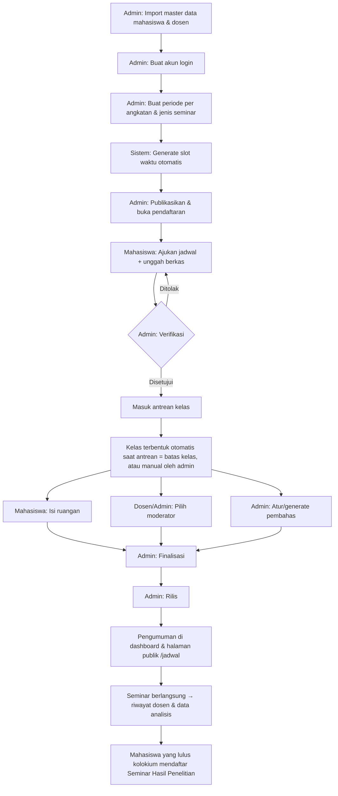
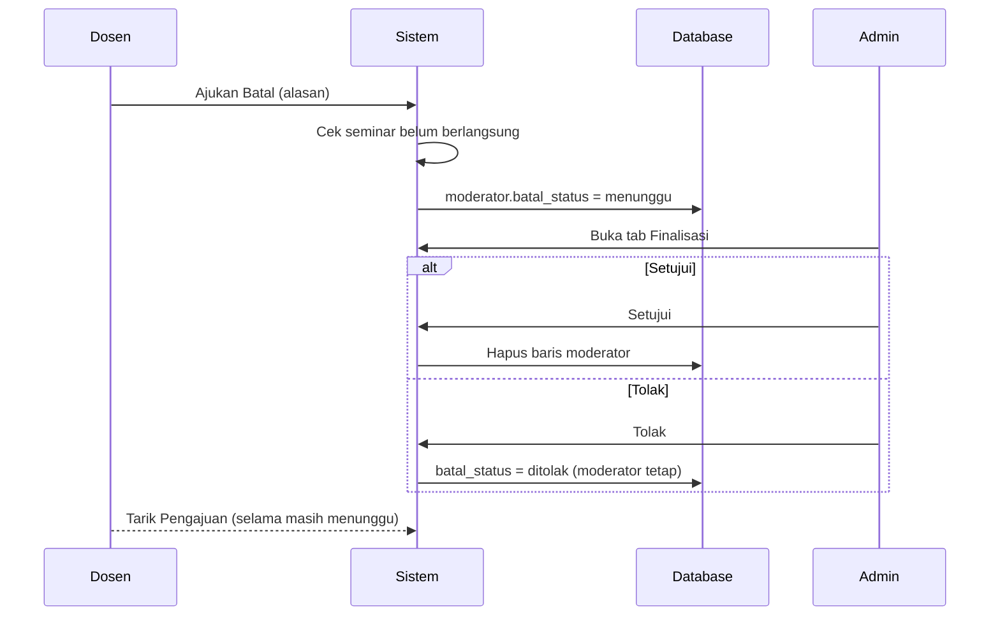
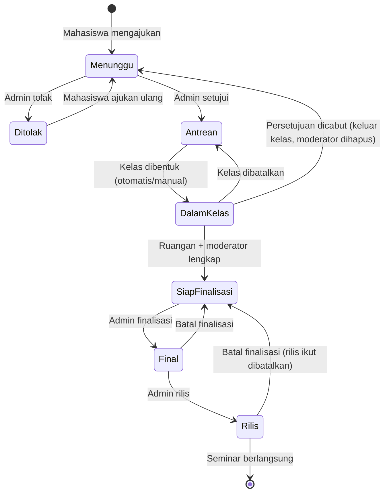
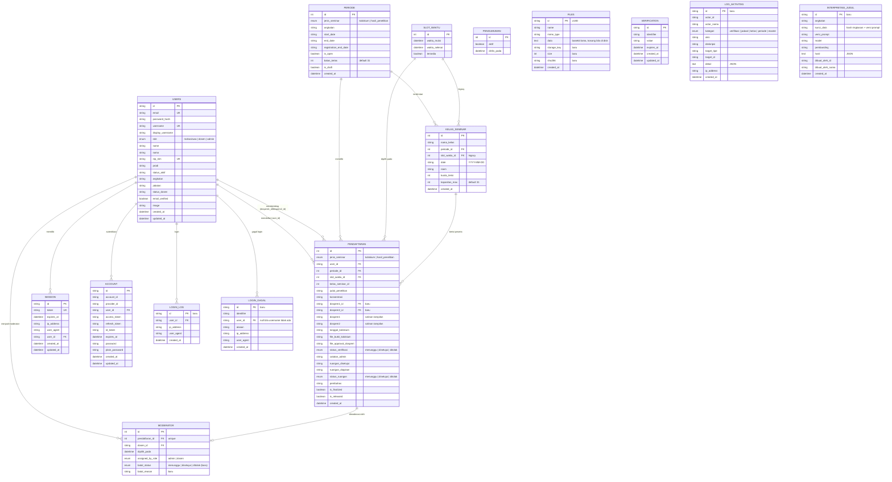
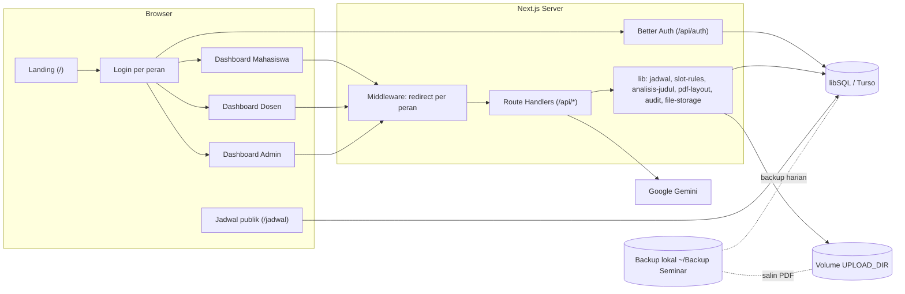

# PRD Update 3 — Sistem Penjadwalan Seminar Kolokium dan Seminar Hasil Penelitian
**Seminar Hub AKN SV IPB University**

| | |
|---|---|
| Versi dokumen | 3.0 (dokumen lengkap, menggantikan PRD awal dan PRD Update V2) |
| Tanggal | 8 Oktober 2026 |
| Kondisi kode | commit `a466055` (5 Oktober 2026) |
| Sumber | Source code aktual (`src/`, `scripts/`, `drizzle/`, `tests/`) dan riwayat commit |

---

## Daftar Isi
1. Latar Belakang & Tujuan
2. Ruang Lingkup & Istilah
3. Peran Pengguna & Hak Akses
4. Gambaran Proses dari Awal sampai Selesai
5. Kebutuhan Fungsional per Tahap
6. Siklus Status Pendaftaran
7. Aturan Bisnis
8. Dashboard Analisis & Analisis Log
9. Kebutuhan Non-Fungsional
10. Database Schema
11. Arsitektur Sistem
12. Daftar API
13. Operasional: Konfigurasi, Migrasi, Backup, Testing
14. Catatan & Isu Terbuka
15. Riwayat Versi

---

## 1. Latar Belakang & Tujuan

### 1.1 Masalah
Pendaftaran seminar sebelumnya dikelola manual lewat spreadsheet oleh admin, sehingga:
- jadwal sering bentrok (mahasiswa, dosen pembimbing, maupun moderator di jam yang sama),
- pembagian kelas tidak merata,
- verifikasi berkas lambat dan tidak terdokumentasi,
- pemilihan moderator tidak terstruktur,
- tidak ada data untuk evaluasi prodi (progres mahasiswa, tren topik penelitian).

### 1.2 Tujuan
1. Mahasiswa mengajukan jadwal seminar secara mandiri dengan pengecekan bentrok otomatis.
2. Admin memverifikasi berkas, membentuk kelas, mengatur pembahas, memfinalisasi, dan merilis jadwal dari satu dashboard.
3. Dosen memilih sendiri mahasiswa yang akan dimoderasi, tanpa bentrok dengan jadwal bimbingannya.
4. Jadwal final dapat dilihat oleh mahasiswa, dosen, dan publik.
5. Prodi (Kaprodi/Sekprodi) mendapat analisis progres mahasiswa dan judul penelitian, termasuk laporan PDF untuk rapat.

### 1.3 Indikator Keberhasilan
- Tidak ada jadwal bentrok yang lolos ke jadwal final (ditegakkan di server, bukan hanya di tampilan).
- Seluruh tahapan (pengajuan → rilis) tercatat di sistem dan dapat diaudit (log aktivitas admin).
- Data tidak hilang: backup harian dan berkas tersimpan di volume persisten.

---

## 2. Ruang Lingkup & Istilah

### 2.1 Dalam Ruang Lingkup
- Dua jenis seminar: **Seminar Kolokium** dan **Seminar Hasil Penelitian** (prasyarat: kolokium selesai).
- Master data mahasiswa, dosen, admin; pembuatan akun login.
- Periode pendaftaran per angkatan & jenis seminar, slot waktu otomatis.
- Pengajuan, verifikasi, kelas, ruangan, moderator, pembahas, finalisasi, rilis, pengumuman.
- Rekapitulasi dosen, ekspor Excel/PDF, Dashboard Analisis, Laporan Analisis PDF, Analisis Log.

### 2.2 Di Luar Ruang Lingkup
- Penilaian/nilai seminar, berita acara, dan tanda tangan digital.
- Manajemen ruangan sebagai master data (ruangan diisi sebagai teks oleh mahasiswa).
- Notifikasi email/WhatsApp.
- Pendaftaran akun mandiri (sign-up publik dinonaktifkan).

### 2.3 Istilah
| Istilah | Arti |
|---|---|
| **Periode** | Masa pendaftaran untuk satu angkatan dan satu jenis seminar, berisi tanggal mulai/selesai seminar dan batas pendaftaran. |
| **Slot** | Satu jam seminar (mis. 08:00–08:50 WIB) pada satu tanggal. |
| **Kelas** | Kelompok mahasiswa (maks. *batas kelas*, default 31) dalam satu periode. Dalam satu kelas, setiap jam hanya diisi satu mahasiswa. |
| **Antrean** | Pendaftaran yang sudah disetujui tetapi belum masuk kelas. |
| **Dospem** | Dosen pembimbing 1 (wajib) dan 2 (opsional). |
| **Moderator** | Dosen yang memandu seminar satu mahasiswa (1 mahasiswa = 1 moderator). |
| **Pembahas** | Sesama mahasiswa di kelas yang sama yang ditugaskan membahas penyaji. |
| **Finalisasi** | Penguncian data jadwal satu mahasiswa oleh admin. |
| **Rilis** | Publikasi jadwal yang sudah difinalisasi ke pengumuman. |

---

## 3. Peran Pengguna & Hak Akses

| Peran | Login | Hak utama |
|---|---|---|
| **Mahasiswa** | `/login/mahasiswa` (username + password) | Mengajukan jadwal, mengunggah berkas, mengisi/mengajukan pindah ruangan, melihat status, kelas, dan pengumuman, mengubah password. |
| **Dosen** | `/login/dosen` | Melihat jadwal bimbingan, memilih/membatalkan moderasi, melihat riwayat, mengubah password. |
| **Admin** | `/login/admin` | Seluruh pengelolaan: master data, akun, periode, verifikasi, kelas, ruangan, moderator, pembahas, finalisasi, rilis, rekap, analisis, log. |
| **Publik** | Tanpa login | Halaman `/jadwal` berisi jadwal yang sudah dirilis. |

**Perlindungan akses**
- Middleware mengarahkan pengguna tanpa sesi ke halaman login sesuai peran, dan mengarahkan pengguna yang login ke dashboard perannya sendiri.
- Setiap API memeriksa sesi dan peran di server (`requireAdmin()` untuk API admin; peran mahasiswa/dosen untuk API masing-masing).
- Field `role`, `nama`, `nipNim`, dan profil tidak dapat diubah oleh pengguna sendiri (Better Auth `input: false`).
- Berkas hanya dapat dibuka oleh admin atau mahasiswa pemiliknya.

---

## 4. Gambaran Proses dari Awal sampai Selesai

### 4.1 Alur Besar


### 4.2 Sequence Diagram End-to-End
```mermaid
sequenceDiagram
    participant A as Admin
    participant M as Mahasiswa
    participant Do as Dosen
    participant S as Sistem (Next.js)
    participant D as Database (libSQL)
    participant F as Penyimpanan Berkas (UPLOAD_DIR)

    A->>S: Import Excel mahasiswa & dosen, buat akun
    S->>D: Insert users, account
    A->>S: Buat periode (angkatan, jenis, tanggal, batas kelas)
    S->>D: Insert periode + generate slot_waktu
    A->>S: Publikasikan & buka periode
    M->>S: Pilih jenis seminar, slot, dospem, isi judul, unggah PDF
    S->>D: Validasi slot, periode, bentrok dospem (transaksi)
    S->>F: Simpan PDF (setelah semua validasi lolos)
    S->>D: Insert pendaftaran (status menunggu) + files
    A->>S: Verifikasi (setujui/tolak + catatan)
    S->>D: Update status; bentuk kelas otomatis bila antrean penuh
    M->>S: Isi ruangan
    Do->>S: Pilih mahasiswa untuk dimoderasi
    S->>D: Cek bukan bimbingan sendiri & tidak bentrok → insert moderator
    A->>S: Generate pembahas per kelas
    S->>D: Simpan pembahas sekaligus (batch)
    A->>S: Finalisasi (syarat: disetujui, kelas, ruangan, moderator)
    A->>S: Rilis
    S->>D: is_released = true
    M->>S: Lihat pengumuman
    Do->>S: Lihat jadwal moderasi & bimbingan
    A->>S: Buka Dashboard Analisis / unduh Laporan Analisis PDF
```

---

## 5. Kebutuhan Fungsional per Tahap

### 5.1 Tahap 0 — Master Data & Akun (Admin)
- Menu **Data Master Pengguna** dengan tab **Mahasiswa**, **Dosen**, **Admin**.
- **Import Excel** (`.xlsx/.xls`, tersedia template):
  - Mahasiswa: kolom NIM, Nama, Angkatan. Email placeholder `nim@student.ipb.ac.id`, prodi Akuntansi, status Aktif.
  - Dosen: kolom NIP/NPI, Nama Dosen. Email placeholder `nip@dosen.ipb.ac.id`.
  - Data dengan NIM/NIP yang sudah ada dilewati.
- Tambah, ubah, hapus satu data; **hapus terpilih** (bulk delete); tabel dapat diurutkan.
- **Buat akun** per pengguna atau **buat semua akun**: username dibuat dari nama depan (gelar diabaikan) + angka unik, misalnya `budi_123`; password awal default yang wajib diganti pengguna.
- Mahasiswa dan dosen dapat **mengubah password** sendiri dari dashboard.
- Mengubah nama dosen ikut memperbarui salinan nama dospem pada pendaftaran.

### 5.2 Tahap 1 — Periode & Slot (Admin)
- Alur menu: **Pilih Kategori Seminar** (Kolokium / Hasil Penelitian) → **Daftar Periode** per angkatan → **Pengaturan Periode** → **Manajemen**.
- Data periode: angkatan, jenis seminar, tanggal mulai & selesai seminar, **Batas Pendaftaran**, batas kelas (default 31), status draft, status buka/tutup.
- Satu angkatan hanya boleh memiliki **satu periode per jenis seminar**.
- Periode baru berstatus **draft** (tidak terlihat mahasiswa) hingga dipublikasikan.
- Saat periode dibuka, sistem **meng-generate slot** untuk rentang tanggal seminar: Senin–Sabtu, pukul 08:00–16:50 WIB per jam (durasi 50 menit), tanpa slot 12:00; slot yang sudah ada tidak digandakan.
- Periode yang sudah memiliki pendaftar **tidak dapat dihapus**.

### 5.3 Tahap 2 — Pengajuan Jadwal (Mahasiswa)
Dashboard mahasiswa: pilih jenis seminar, lalu tab **Pengajuan**, **Status**, **Kelas**, **Ruangan**, **Pengumuman**.

**Kondisi tampilan**
- *Periode Belum Dibuka*: tidak ada periode aktif untuk angkatan & jenis seminar tersebut.
- *Persyaratan Belum Terpenuhi*: untuk Seminar Hasil, kolokium belum selesai & disetujui.
- *Anda Telah Mengajukan Jadwal*: menampilkan detail pengajuan.

**Isian form**
| Field | Kolokium | Hasil Penelitian |
|---|---|---|
| Judul penelitian | Wajib | Wajib |
| Konsentrasi | — | Wajib |
| Dosen Pembimbing 1 | Wajib | Wajib |
| Dosen Pembimbing 2 | Opsional, ≠ Dospem 1 | Opsional, ≠ Dospem 1 |
| Slot jadwal (kalender + jam) | Wajib | Wajib |
| PDF Persetujuan Dosen Pembimbing | Wajib | Wajib |
| PDF Bukti Forum Kolokium | — | Wajib |
| Tanggal kolokium | — | Diisi otomatis dari pendaftaran kolokium yang disetujui |

**Aturan berkas**: PDF, maksimal **500 KB**; disimpan setelah semua validasi lolos.

**Kalender slot**
- Hanya menampilkan tanggal dalam rentang periode; hari Minggu disembunyikan.
- Status slot: tersedia, terambil (*"Slot terambil, menunggu kelas terbentuk"*), atau bentrok dengan jadwal dospem.
- Ketersediaan diperbarui setiap 10 detik; slot yang dipilih otomatis dilepas bila menjadi tidak tersedia.

**Pengajuan ulang**: bila ditolak, mahasiswa dapat mengajukan ulang pada periode yang sama (berkas lama dapat dipakai lagi).

### 5.4 Tahap 3 — Verifikasi (Admin)
- Tab **Verifikasi**: tabel berisi No, mahasiswa, dospem 1 & 2, judul lengkap, konsentrasi, jadwal, ruangan, status, aksi; pencarian (termasuk nama dosen) dan filter konsentrasi.
- Modal verifikasi menampilkan pratinjau berkas PDF, pilihan **Setujui / Tolak / Menunggu**, dan catatan admin.
- Pendaftaran yang sudah difinalisasi tidak dapat diubah verifikasinya (batalkan finalisasi dulu).
- Bila status persetujuan dicabut, mahasiswa keluar dari kelas dan moderatornya dihapus.
- Setelah disetujui, bila antrean periode mencapai batas kelas, **kelas terbentuk otomatis**.

### 5.5 Tahap 4 — Pembentukan Kelas (Admin)
- Otomatis (saat antrean = batas kelas) atau manual (**Bentuk Kelas** dari antrean, berapa pun jumlahnya).
- Mahasiswa diambil dari antrean berurutan sesuai waktu daftar, hingga batas kelas.
- Nama kelas berurutan: A–Z, lalu A1–Z1, dst.
- **Pindah kelas**: hanya ke kelas pada periode yang sama, pendaftaran belum difinalisasi, dan tidak ada mahasiswa lain di kelas tujuan pada jam yang sama.
- **Batalkan kelas**: mahasiswa kembali ke antrean; ditolak bila ada mahasiswa yang sudah difinalisasi.
- Daftar kelas dapat diekspor ke PDF.

### 5.6 Tahap 5 — Ruangan (Mahasiswa & Admin)
- Setelah disetujui, mahasiswa mengisi **nama ruangan** (wajib, maks. 100 karakter). Pengisian pertama langsung berlaku, hanya sekali, dan tidak dapat dilakukan setelah finalisasi.
- Perubahan berikutnya melalui **Pengajuan Pindah Ruangan** yang harus disetujui admin.
- Pendaftaran yang ditolak tidak dapat mengatur ruangan.

### 5.7 Tahap 6 — Moderator (Dosen & Admin)
**Dosen** (dashboard dosen)
- Melihat daftar jadwal mahasiswa yang sudah masuk kelas; mahasiswa bimbingan sendiri diberi tanda *"Anda Pembimbing"* dan tidak dapat dipilih.
- **Pilih sebagai Moderator** untuk satu mahasiswa. Ditolak bila: sudah diambil dosen lain, belum masuk kelas atau belum disetujui, mahasiswa bimbingan sendiri, jadwal sudah lewat atau belum ditentukan, atau dosen sudah menjadi pembimbing/moderator di jam yang sama.
- **Ajukan Batal** (alasan maks. 500 karakter) atau **Tarik Pengajuan**; tidak tersedia untuk seminar yang sudah berlangsung.

**Admin**
- Dapat memilih/mengganti moderator langsung dari dropdown (aturan bentrok yang sama berlaku).
- Menyetujui atau menolak pengajuan batal di tab **Finalisasi** (badge oranye bila ada pengajuan menunggu). Bila disetujui, moderator dihapus dan jadwal kembali terbuka untuk dosen lain.



### 5.8 Tahap 7 — Pembahas (Admin)
- Tab **Pembahas** per kelas. Pembahas dipilih dari sesama mahasiswa di kelas yang sama.
- **Generate Pembahas**: mahasiswa diurutkan berdasarkan dospem, lalu setiap penyaji dipasangkan dengan mahasiswa berjarak setengah kelas (agar dospemnya cenderung berbeda). Minimal 2 mahasiswa per kelas. Disimpan sekaligus untuk satu kelas (semua atau tidak sama sekali); ditolak untuk kelas yang sudah dirilis.
- **Manual**: tambah/ubah/hapus pembahas per mahasiswa; satu mahasiswa maksimal menjadi pembahas **2 kali**; pilihan dengan dospem yang sama diberi peringatan.

### 5.9 Tahap 8 — Finalisasi (Admin)
- Syarat: **disetujui + sudah masuk kelas + ruangan sudah ditetapkan + moderator sudah dipilih**. Pembahas opsional.
- **Batal Finalisasi** mengembalikan status finalisasi dan rilis menjadi belum.

### 5.10 Tahap 9 — Rilis & Pengumuman
- Admin merilis per mahasiswa atau **sekaligus** (release batch). Hanya pendaftaran yang sudah difinalisasi dan memiliki ruangan yang dirilis.
- Tab **Pengumuman** admin: tabel jadwal yang dapat diurutkan per kolom, ekspor PDF dengan blok judul (jenis seminar, angkatan, kelas, tanggal).
- **Mahasiswa**: tab Pengumuman menampilkan jadwal yang dirilis (tanggal, jam, ruangan, dospem 1 & 2, moderator, pembahas), filter tanggal, pengurutan, baris milik sendiri di atas.
- **Publik**: halaman `/jadwal` menampilkan semua jadwal yang sudah dirilis.

### 5.11 Dashboard Dosen
- Ringkasan: **Jadwal Memoderatori Mendatang** dan **Jadwal Seminar Bimbingan Mendatang**.
- Tabel dapat diurutkan berdasarkan jadwal pelaksanaan; **Riwayat Moderasi Selesai** dan **Riwayat Bimbingan Selesai**.
- Navbar responsif untuk ponsel & landscape.

### 5.12 Rekapitulasi & Ekspor (Admin)
- Tab **Rekapitulasi**: beban setiap dosen (jumlah bimbingan sebagai dospem 1/2 dan jumlah moderasi), pencarian, ekspor **Excel** dan **PDF** (dengan baris total).
- Semua PDF admin memakai tata letak seragam: blok judul, tabel grid navy, footer tanggal cetak & nomor halaman.

---

## 6. Siklus Status Pendaftaran


Pemetaan ke kolom database:
| Status | `status_verifikasi` | `kelas_seminar_id` | `is_finalized` | `is_released` |
|---|---|---|---|---|
| Menunggu | menunggu | null | false | false |
| Ditolak | ditolak | null | false | false |
| Antrean | disetujui | null | false | false |
| Dalam kelas | disetujui | terisi | false | false |
| Final | disetujui | terisi | true | false |
| Rilis | disetujui | terisi | true | true |

---

## 7. Aturan Bisnis

### 7.1 Jadwal & Slot
| Kode | Aturan |
|---|---|
| J1 | Slot berlaku Senin–Sabtu, 08:00–16:50 WIB, tanpa slot 12:00 (istirahat). |
| J2 | Slot tidak boleh di masa lalu dan harus di dalam rentang tanggal periode. |
| J3 | Pendaftaran ditolak setelah **Batas Pendaftaran**, untuk periode draft/tertutup, periode angkatan lain, atau jenis seminar lain. |
| J4 | Satu mahasiswa hanya satu pendaftaran aktif per periode. |
| J5 | Satu jam slot hanya dapat diambil satu mahasiswa per jenis seminar sampai kelasnya terbentuk; setelah kelas terbentuk, jam yang sama dapat diambil lagi untuk kelas berikutnya. |
| J6 | Dosen tidak boleh berada di dua seminar pada jam yang sama, baik sebagai pembimbing maupun moderator, lintas jenis seminar. |
| J7 | Ketersediaan dicocokkan berdasarkan **waktu** slot, bukan ID slot (tabel slot dapat berisi baris duplikat untuk jam yang sama). |
| J8 | Seminar Hasil Penelitian mensyaratkan kolokium yang sudah selesai dan disetujui. |

### 7.2 Kelas, Moderator, Pembahas
| Kode | Aturan |
|---|---|
| K1 | Kapasitas kelas = batas kelas periode (default 31). |
| K2 | Seorang mahasiswa tidak pernah berada di dua kelas; kelas duplikat yang kosong dihapus. |
| K3 | Dalam satu kelas tidak boleh ada dua mahasiswa pada jam yang sama. |
| M1 | 1 pendaftaran = maksimal 1 moderator (unik di database). |
| M2 | Dosen tidak boleh memoderatori mahasiswa bimbingannya sendiri. |
| M3 | Moderator tidak dapat dipilih/dibatalkan untuk seminar yang sudah lewat. |
| P1 | Pembahas berasal dari kelas yang sama; maksimal 2 kali menjadi pembahas. |

### 7.3 Finalisasi & Rilis
| Kode | Aturan |
|---|---|
| F1 | Finalisasi: disetujui + kelas + ruangan + moderator. |
| F2 | Data yang sudah difinalisasi tidak dapat diubah verifikasi, kelas, atau ruangannya. |
| F3 | Rilis hanya untuk data yang difinalisasi dan memiliki ruangan. |
| F4 | Kelas dengan mahasiswa terfinalisasi tidak dapat dibatalkan. |

---

## 8. Dashboard Analisis & Analisis Log

### 8.1 Dashboard Analisis
- Dibuka pada angkatan terbaru; mode **Bandingkan Angkatan** tersedia bila ada ≥ 2 angkatan.

| Bagian | Isi |
|---|---|
| **Progres Mahasiswa** | Funnel kolokium selesai → selesai Seminar Hasil; daftar mahasiswa yang sudah kolokium tapi belum mendaftar Seminar Hasil. |
| **Durasi Kolokium → Seminar Hasil** | Jumlah & persentase per rentang durasi, median (dalam hari bila < 1 bulan). Mode banding: bar 100% bertumpuk per angkatan + median. |
| **Sebaran Konsentrasi** | Pendaftaran Seminar Hasil yang disetujui, bar horizontal berperingkat (100% bertumpuk saat membandingkan). |
| **Analisis Judul** | Berbasis aturan (tanpa AI), lihat 8.2. |
| **Interpretasi AI** | Opsional, lihat 8.3. |

### 8.2 Analisis Judul (berbasis aturan)
- Sumber: judul Seminar Hasil yang **sudah disetujui**.
- Setiap judul dipecah menjadi **topik**, **objek**, dan **lokasi**, sehingga berlaku untuk judul kuantitatif maupun kualitatif.
- Hasil:
  - judul **identik** dan **mirip** (irisan kata pada topik + objek, minimal satu topik sama) dengan nama, NIM, dan konsentrasi kedua mahasiswa;
  - topik populer, pasangan topik yang sering muncul bersama, objek, lokasi;
  - judul paling unik (berdasarkan kelangkaan topik), topik per konsentrasi;
  - pangsa topik per angkatan (mode banding).

### 8.3 Interpretasi AI (Gemini)
- Model `gemini-3.6-flash`, `temperature 0` dengan seed tetap, retry & pesan error yang ramah.
- Server mengirim ringkasan agregat **tanpa nama/NIM**, ditambah angkatan sebelumnya sebagai pembanding.
- Jawaban dalam skema JSON tetap; topik, nomor pasangan, dan ukuran daftar divalidasi; jumlah per tema dihitung ulang oleh sistem.
- Isi: ringkasan eksekutif, tema, temuan, penilaian pasangan judul mirip ("X dari N substansial" dihitung sistem), kecocokan konsentrasi, celah topik, rekomendasi untuk **Admin** dan untuk **Kaprodi/Sekprodi**.
- Kasus jelas diputuskan sistem: judul identik atau topik+objek sama (hanya lokasi berbeda) selalu dinilai substansial.
- Rekomendasi hanya mengutip pasangan yang substansial (dengan nomor pasangan), selalu menyebut objeknya, berbasis data, tanpa duplikasi.
- **Disimpan per angkatan**: dimuat otomatis, sama untuk semua admin, tidak memanggil Gemini lagi bila data sama. **Buat Ulang** membuat versi baru (versi lama tetap tersimpan). Ditampilkan pembuat, waktu, dan peringatan bila data judul sudah berubah.

### 8.4 Laporan Analisis (PDF)
Satu laporan per angkatan dari header Dashboard Analisis:
1. Progres Mahasiswa;
2. Durasi Kolokium ke Seminar Hasil;
3. Sebaran Konsentrasi;
4. Analisis Judul (judul yang perlu dicek beserta nama/NIM, topik, objek, lokasi; topik per konsentrasi; judul paling unik);
5. Interpretasi AI bila tersimpan (tanggal, pembuat, catatan data berubah);
6. Catatan metode, nomor halaman "Halaman x dari y".

### 8.5 Analisis Log
| Tab | Isi |
|---|---|
| **Login** | Setiap login sukses dicatat (`login_log`). KPI, grafik login per hari dengan penanda periode, adopsi per angkatan, daftar mahasiswa yang belum pernah login (dapat diekspor), tabel detail dengan filter role/tanggal, waktu aktif relatif, riwayat login per pengguna (IP, perangkat). Login admin tidak dihitung dalam total. |
| **Keamanan** | Login gagal (`login_gagal`): jumlah 24 jam terakhir, akun dengan ≥ 3 kegagalan berturut-turut, login admin dari perangkat baru. |
| **Aktivitas Admin** | Audit trail (`log_aktivitas`) untuk verifikasi, jadwal, kelas, periode, master data; timeline per hari dengan filter & pencarian. |

---

## 9. Kebutuhan Non-Fungsional

### 9.1 Keamanan
- Autentikasi Better Auth dengan plugin username; sign-up publik dinonaktifkan; akun hanya dibuat admin.
- Field sensitif profil tidak dapat diubah pengguna (`input: false`).
- Otorisasi di server untuk setiap API; akses berkas dibatasi pemilik & admin.
- Konten AI dirender tanpa `dangerouslySetInnerHTML` (mencegah XSS).
- Endpoint maintenance dilindungi `MAINTENANCE_TOKEN`.
- Script seed menolak berjalan pada database non-lokal.
- Data pribadi (nama/NIM) tidak dikirim ke layanan AI.

### 9.2 Integritas Data & Konkurensi
- Alur cek-lalu-tulis berjalan dalam **transaksi tulis** (`transaksi()`: antre per proses, retry saat database sibuk): pendaftaran, pemilihan moderator, verifikasi, bentuk/batal/pindah kelas, finalisasi, pembahas batch, hapus periode.
- Dua mahasiswa yang submit slot yang sama bersamaan: yang lebih dulu mendapat slot, yang lain ditolak (HTTP 409).
- Pencatatan audit dijalankan via `after()` sehingga tidak memperlambat respons.

### 9.3 Performa
- Polling dashboard 30 detik; polling slot mahasiswa 10 detik; aksi pengguna langsung memicu refresh.
- Polling dijeda saat ada penulisan, dan hasil poll yang lebih lama dari edit lokal dibuang.
- Query N+1 dihilangkan (API moderator dosen: 3 query total; tanggal kolokium admin: ~20 dtk → ~1 dtk).
- Dashboard admin menampilkan data secara progresif setiap respons API tiba.

### 9.4 Keandalan
- Berkas PDF di volume persisten (`UPLOAD_DIR`) dengan verifikasi SHA-256.
- Backup harian data & PDF dengan retensi bertingkat; restore teruji.
- Perubahan skema melalui migrasi berversi.

### 9.5 Kegunaan
- Antarmuka Bahasa Indonesia, responsif (ponsel & desktop).
- Tabel tanpa scroll horizontal, judul ditampilkan utuh, kolom No, pengurutan & filter.

---

## 10. Database Schema (Drizzle ORM)
Sumber: `src/db/schema.ts`, setelah migrasi `0000`–`0003`. Total **15 tabel**. Label **(baru)** menandai tabel/kolom yang ditambahkan sejak PRD V2.

### 10.1 Diagram Relasi


### 10.2 Ringkasan Tabel
| Tabel | Fungsi | Relasi & aturan hapus |
|---|---|---|
| `users` | Akun mahasiswa, dosen, admin. `email`, `username`, `nip_nim` unik. | — |
| `periode` | Siklus pendaftaran per jenis seminar & angkatan. `is_draft` saat disiapkan admin. | Hapus periode → pendaftaran & kelas ikut terhapus (cascade); karena itu API menolak hapus periode yang punya pendaftaran. |
| `slot_waktu` | Daftar jam seminar. Bisa berisi baris duplikat untuk jam yang sama → ketersediaan dicocokkan berdasarkan waktu. | — |
| `pendaftaran` | Data pengajuan seminar per mahasiswa, status verifikasi, ruangan, pembahas, finalisasi & rilis. | `user_id` cascade; `periode_id` cascade; `slot_waktu_id` set null; `dospem1_id`/`dospem2_id` set null. `kelas_seminar_id` tanpa foreign key. |
| `kelas_seminar` | Kelompok mahasiswa per tanggal & ruangan dalam satu periode. | `periode_id` cascade; `slot_waktu_id` set null (legacy). |
| `moderator` | 1 pendaftaran = maks. 1 moderator (`pendaftaran_id` unik), plus status pengajuan batal. | `pendaftaran_id` cascade; `dosen_id` cascade. |
| `pengumuman` | Penanda status rilis pengumuman global. | — |
| `files` | Metadata berkas PDF; isi berkas di `UPLOAD_DIR` (`storage_key`), base64 hanya untuk data lama. | Direferensikan dari `pendaftaran.file_*` (tanpa foreign key). |
| `session`, `account`, `verification` | Tabel Better Auth. | `user_id` cascade. |
| `login_log` | Riwayat login sukses (tidak terhapus saat logout). Index: `user_id`, `created_at`. | `user_id` cascade. |
| `login_gagal` | Percobaan login gagal. Index: `created_at`. | `user_id` cascade (boleh null). |
| `log_aktivitas` | Audit trail aksi admin; nama aktor & label target disimpan sebagai teks. Index: `created_at`. | Tanpa foreign key (tetap terbaca walau data asal dihapus). |
| `interpretasi_judul` | Riwayat Interpretasi AI per angkatan; `kunci_data` dipakai untuk mendeteksi data berubah. Index: (`angkatan`, `created_at`). | Tanpa foreign key. |

### 10.3 Perubahan dibanding PRD V2
- **`pendaftaran`**: + `dospem1_id`, `dospem2_id` (identitas dospem berdasarkan ID; kolom nama tetap sebagai salinan tampilan). Kolom `konsentrasi`, `catatan_admin`, `status_ruangan` sudah ada sebelumnya namun belum tercatat di PRD V2.
- **`moderator`**: + `batal_status`, `batal_reason` untuk alur pembatalan moderator.
- **`files`**: + `storage_key`, `size`, `sha256`. Keputusan V2 menyimpan base64 di database digantikan oleh volume disk persisten agar database ringan dan backup cepat.
- **Tabel baru**: `login_log`, `login_gagal`, `log_aktivitas`, `interpretasi_judul`.
- Tabel `pengumuman` dan `verification` sudah ada sejak awal, kini ikut didokumentasikan.

---

## 11. Arsitektur Sistem

### 11.1 Tech Stack
| Lapisan | Teknologi |
|---|---|
| Framework | Next.js 16.2 (App Router, Turbopack), React 19.2, TypeScript |
| UI | Tailwind CSS, Lucide Icons, Recharts (grafik) |
| Database | SQLite / libSQL (Turso) via `@libsql/client` |
| ORM & migrasi | Drizzle ORM 0.45, drizzle-kit |
| Autentikasi | Better Auth 1.6 (plugin username) |
| AI | Google Gemini via `@google/genai` (opsional) |
| Ekspor | SheetJS (Excel), jsPDF + jspdf-autotable (PDF) |
| Testing | `node:test` + `tsx` |
| Deploy | Coolify dengan volume persisten untuk berkas |

### 11.2 Diagram Komponen


### 11.3 Struktur Kode Utama
```
src/
  app/
    page.tsx                 # Landing (pilih portal)
    login/[role]/            # Login mahasiswa/dosen/admin
    jadwal/                  # Jadwal publik (yang sudah dirilis)
    dashboard/
      mahasiswa/page.tsx
      dosen/page.tsx
      admin/
        page.tsx             # navigasi & pergantian view
        useAdminDashboard.tsx, AdminContext.tsx, admin-types.ts
        _components/         # View*, Tab*, Modal*
        DashboardAnalisis.tsx, AnalisisJudulPanel.tsx, InterpretasiAIPanel.tsx
        AnalisisLog.tsx, LogDetailPengguna.tsx, LogKeamanan.tsx, LogAktivitasAdmin.tsx
    api/                     # lihat bagian 12
  db/schema.ts, db/index.ts  # skema Drizzle & helper transaksi()
  lib/
    auth.ts, auth-client.ts, admin-auth.ts
    jadwal.ts, slot-rules.ts, slot-generator.ts
    analisis-judul.ts, analisis-judul-db.ts, interpretasi-judul.ts
    laporan-analisis-pdf.ts, pdf-layout.ts
    file-storage.ts, audit.ts, user-agent.ts, format-durasi.ts
  middleware.ts
drizzle/                     # migrasi 0000–0003
scripts/                     # backup, restore, migrasi, data uji, seed
tests/                       # suite node:test
docs/                        # PRD
```

---

## 12. Daftar API

### 12.1 Mahasiswa
| Method | Endpoint | Fungsi |
|---|---|---|
| GET | `/api/mahasiswa/dashboard` | Data dashboard: periode, status, kelas, pengumuman, daftar dosen. |
| GET | `/api/mahasiswa/slot` | Ketersediaan slot per jenis seminar & dospem. |
| POST | `/api/mahasiswa/pendaftaran` | Ajukan jadwal (multipart, berkas PDF). |
| PUT | `/api/mahasiswa/pendaftaran` | Simpan ruangan awal / ajukan pindah ruangan. |

### 12.2 Dosen
| Method | Endpoint | Fungsi |
|---|---|---|
| GET | `/api/dosen/dashboard` | Jadwal bimbingan & moderasi, riwayat. |
| GET / POST | `/api/dosen/moderator` | Daftar jadwal yang dapat dimoderasi / pilih moderator. |
| POST | `/api/dosen/moderator/batal` | Ajukan / tarik pengajuan batal moderator. |

### 12.3 Admin
| Method | Endpoint | Fungsi |
|---|---|---|
| GET, POST | `/api/admin/periode` | Daftar & buat periode. |
| GET, PUT, DELETE | `/api/admin/periode/[id]` | Detail, ubah (buka/tutup, publikasi, generate slot), hapus. |
| GET | `/api/admin/pendaftaran` | Semua pendaftaran + moderator, status batal, tanggal kolokium. |
| PUT | `/api/admin/pendaftaran/[id]/verifikasi` | Setujui/tolak/menunggu + catatan. |
| PUT | `/api/admin/pendaftaran/[id]/ruangan` | Setujui pengajuan pindah ruangan. |
| PUT | `/api/admin/pendaftaran/[id]/moderator` | Pilih/ganti moderator. |
| POST | `/api/admin/pendaftaran/[id]/batal-moderator` | Setujui/tolak pengajuan batal. |
| PUT | `/api/admin/pendaftaran/[id]/pembahas` | Simpan pembahas satu mahasiswa. |
| PUT | `/api/admin/pendaftaran/pembahas-batch` | Simpan pembahas satu kelas sekaligus. |
| PUT | `/api/admin/pendaftaran/[id]/pindah-kelas` | Pindah/masukkan ke kelas. |
| PUT | `/api/admin/pendaftaran/[id]/finalisasi` | Finalisasi. |
| PUT | `/api/admin/pendaftaran/[id]/batal-finalisasi` | Batalkan finalisasi & rilis. |
| PUT | `/api/admin/pendaftaran/[id]/release` | Rilis satu pendaftaran. |
| PUT | `/api/admin/pendaftaran/release-batch` | Rilis banyak pendaftaran. |
| GET | `/api/admin/kelas` | Daftar kelas. |
| POST | `/api/admin/kelas/bentuk` | Bentuk kelas dari antrean. |
| DELETE | `/api/admin/kelas/[id]` | Batalkan kelas. |
| GET, POST / PUT, DELETE | `/api/admin/master/{mahasiswa,dosen,admin}[/id]` | CRUD master data. |
| POST | `/api/admin/master/{mahasiswa,dosen}/import` | Import Excel. |
| POST | `/api/admin/master/{mahasiswa,dosen,admin}/account` | Buat akun login. |
| POST | `/api/admin/master/bulk-delete` | Hapus banyak data. |
| GET | `/api/admin/analisis/data` | Data Dashboard Analisis & Analisis Judul. |
| GET, POST | `/api/admin/analisis/gemini` | Ambil / buat Interpretasi AI. |
| GET | `/api/admin/log`, `/api/admin/log/aktivitas` | Log login, keamanan, aktivitas admin. |

### 12.4 Umum & Maintenance
| Method | Endpoint | Fungsi |
|---|---|---|
| * | `/api/auth/[...all]` | Better Auth (sign-in, sign-out, change-password, dst.). |
| GET | `/api/files/[id]` | Unduh berkas (admin atau pemilik). |
| POST | `/api/user/save-plain-password` | Menyimpan password baru setelah ganti password (lihat Isu Terbuka). |
| GET, POST | `/api/maintenance/files`, `/api/maintenance/files/[id]` | Pemindahan berkas lama ke disk & unduh untuk backup (token). |

---

## 13. Operasional

### 13.1 Environment Variable
| Variabel | Fungsi |
|---|---|
| `DATABASE_URL` | URL database libSQL/Turso (atau file SQLite lokal). |
| `DATABASE_AUTH_TOKEN` | Token Turso. |
| `APP_URL` | URL aplikasi (Better Auth / script). |
| `UPLOAD_DIR` | Folder penyimpanan PDF (volume persisten di produksi). |
| `GEMINI_API_KEY` | Kunci Gemini untuk Interpretasi AI. |
| `MAINTENANCE_TOKEN` | Token endpoint maintenance berkas. |
| `BACKUP_DIR` | Lokasi backup (default `~/Backup Seminar`). |

### 13.2 Migrasi Database
- `npm run db:generate` membuat migrasi dari perubahan `schema.ts`; `npm run db:migrate` menerapkannya.

| Migrasi | Isi |
|---|---|
| `0000_baseline` | Skema produksi awal (`scripts/migrasi-baseline.ts` mencatatnya sekali pada database lama yang dibuat dengan `push`). |
| `0001_dospem_id` | `dospem1_id`, `dospem2_id` + backfill dari nama yang cocok dengan tepat satu dosen. |
| `0002_file_di_disk` | `storage_key`, `size`, `sha256` pada `files`. |
| `0003_interpretasi_judul` | Tabel `interpretasi_judul`. |

### 13.3 Backup & Restore
- `scripts/backup.ts`: snapshot semua tabel → `~/Backup Seminar/data/*.gz` (bertanggal); setiap PDF disalin sekali ke `~/Backup Seminar/pdf`.
- Retensi: data 30 hari + tanggal 1 tiap bulan selama 12 bulan; PDF permanen. Gagal → notifikasi macOS.
- `scripts/backup-jadwal.sh`: job launchd harian pukul 21:00 (`coba`, `status`, `lepas`).
- `scripts/restore.ts`: restore hanya ke database kosong.

### 13.4 Testing & Data Uji
- `npm test`: suite `node:test` terhadap database SQLite sementara yang dibangun dari migrasi — aturan slot, generator slot, pembentukan kelas, bentrok dosen, validasi slot, transaksi, migrasi/backfill dospem, penyimpanan berkas, analisis judul, interpretasi judul, format durasi.
- `scripts/uji-buat.ts` / `scripts/uji-hapus.ts`: akun & periode `UJICOBA` yang tidak terlihat pengguna asli (pratinjau kecuali `--jalankan`).

### 13.5 Script Lain
| Script | Fungsi |
|---|---|
| `scripts/pindahkan-file.ts` | Memindahkan berkas base64 lama ke disk (selesai 3 Oktober 2026). |
| `scripts/isi-dospem-id.ts` | Menjalankan ulang backfill `dospem*_id`. |
| `scripts/seed-auth.ts`, `npm run db:seed` | Seed data lokal (menolak database non-lokal). |

---

## 14. Catatan & Isu Terbuka
| No | Isu | Rekomendasi |
|---|---|---|
| 1 | Tabel `account` memiliki kolom `plain_password` yang menyimpan password tanpa hash (diisi saat akun dibuat dan saat pengguna mengganti password lewat `/api/user/save-plain-password`). | Hapus kolom & endpoint; ganti dengan fitur reset password oleh admin. |
| 2 | Semua akun baru memakai password awal yang sama. | Generate password acak per akun dan/atau wajibkan ganti password saat login pertama. |
| 3 | Kolom `files.data` (base64) masih ada untuk kompatibilitas data lama, padahal semua berkas sudah di disk. | Hapus melalui migrasi setelah backup terverifikasi. |
| 4 | `pendaftaran.kelas_seminar_id` dan referensi berkas `file_*` tidak memakai foreign key. | Tambahkan foreign key bila migrasi data memungkinkan. |
| 5 | View `coming_soon` ("Modul Seminar Kolokium") tidak lagi dipakai. | Hapus kode yang tidak terpakai. |
| 6 | Tabel `pengumuman` (penanda rilis global) hanya dipakai sebagai penanda di grafik log; rilis sebenarnya per pendaftaran (`is_released`). | Tinjau apakah masih dibutuhkan. |
| 7 | Ruangan diisi sebagai teks bebas oleh mahasiswa. | Pertimbangkan master data ruangan bila diperlukan pengecekan bentrok ruangan. |

---

## 15. Riwayat Versi
| Versi | Tanggal | Ringkasan |
|---|---|---|
| 1.0 | — | PRD awal: konsep sistem pengganti spreadsheet, kelas 31 mahasiswa, moderator per kelas, master ruangan. |
| 2.0 | 16 Sep 2026 | PRD Update: dua jenis seminar, moderator per mahasiswa, pembahas dari sesama mahasiswa, berkas base64 di database. |
| 3.0 | 8 Okt 2026 | Dokumen lengkap ini: aturan jadwal di server, transaksi, pembatalan moderator, keamanan, Dashboard Analisis & Analisis Judul, Interpretasi AI tersimpan, Laporan Analisis PDF, Analisis Log, migrasi, test, backup, berkas di disk, schema lengkap. |
